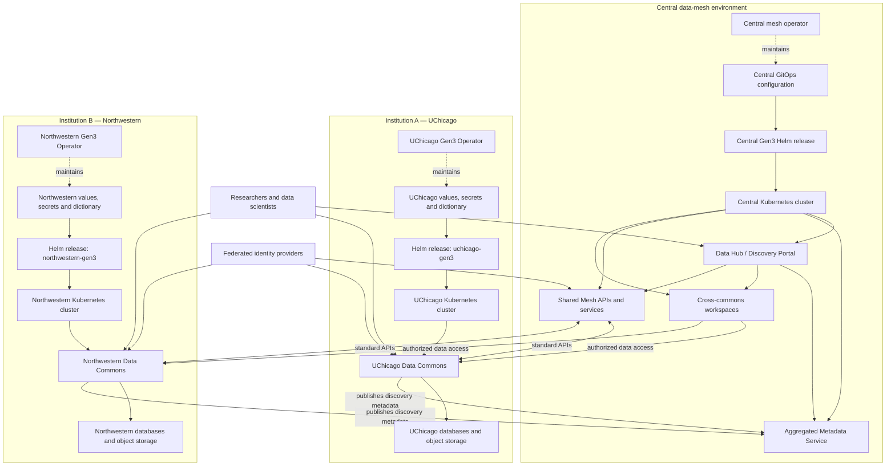

<!-- START doctoc generated TOC please keep comment here to allow auto update -->
<!-- DON'T EDIT THIS SECTION, INSTEAD RE-RUN doctoc TO UPDATE -->
**Table of Contents**

- [1. CDIS Open Source Studies](#1-cdis-open-source-studies)
  - [1.1 General Architecture](#11-general-architecture)
- [3. Cancer Research DS Courses](#3-cancer-research-ds-courses)

<!-- END doctoc generated TOC please keep comment here to allow auto update -->

# 1. CDIS Open Source Studies

## 1.1 General Architecture

# 3. Cancer Research DS Courses

- https://www.coursera.org/specializations/genomic-data-science
- https://www.freecodecamp.org/news/how-to-build-microservices-based-rest-apis-for-healthcare-portals/
