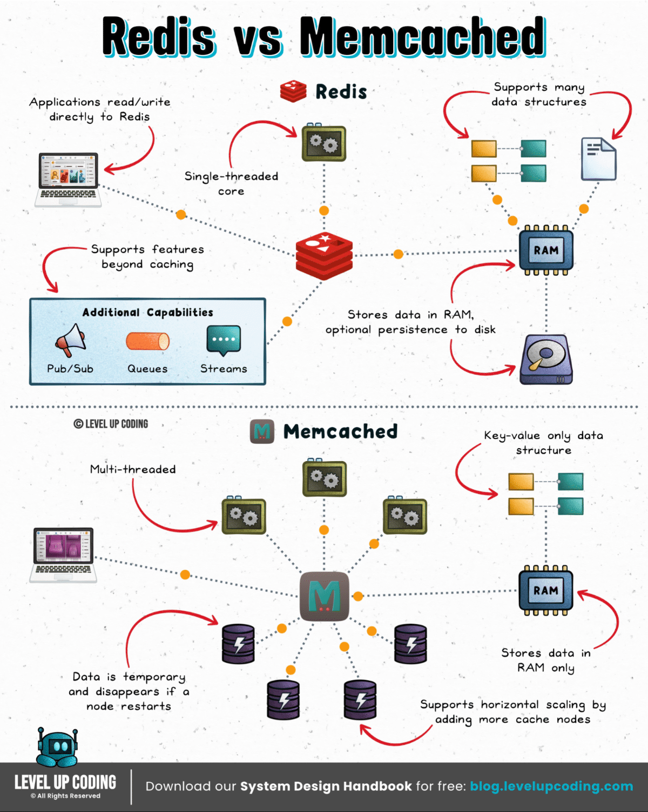
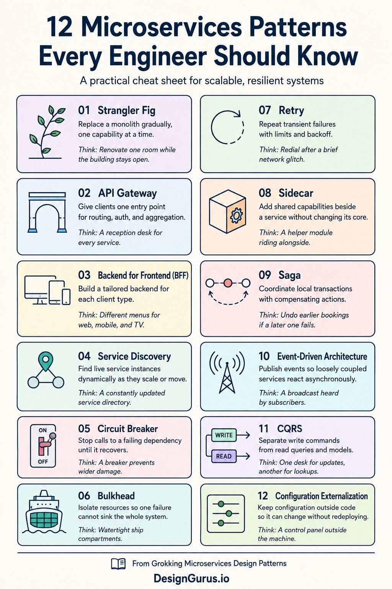
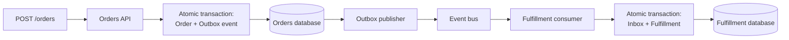

<!-- START doctoc generated TOC please keep comment here to allow auto update -->
<!-- DON'T EDIT THIS SECTION, INSTEAD RE-RUN doctoc TO UPDATE -->
**Table of Contents**

- [1. Backend Development Intro](#1-backend-development-intro)
- [2. REST API](#2-rest-api)
  - [2.1 Common Methods](#21-common-methods)
    - [2.1.1 Headers](#211-headers)
    - [2.1.2 Status Code](#212-status-code)
- [3 System Design Practices](#3-system-design-practices)
  - [3.1 The 4 Pillars of Good System Design](#31-the-4-pillars-of-good-system-design)
    - [3.1.1 Scalability](#311-scalability)
    - [3.1.2 Maintainability](#312-maintainability)
    - [3.1.3 Efficiency](#313-efficiency)
    - [3.1.4 Reliability](#314-reliability)
  - [3.2 The 3 Key Elements of Systems Design](#32-the-3-key-elements-of-systems-design)
    - [3.2.1 Moving Data](#321-moving-data)
    - [3.2.2 Storing Data](#322-storing-data)
    - [3.2.3 Trasforming Data](#323-trasforming-data)
  - [3.3 CAP Theorem](#33-cap-theorem)
    - [3.3.1 Consitency](#331-consitency)
    - [3.3.2 Availability](#332-availability)
      - [3.3.2.1 SLO Service Level Objectives](#3321-slo-service-level-objectives)
      - [3.3.2.2 SLA Service Level Agreement](#3322-sla-service-level-agreement)
      - [3.3.2.3 Building Resiliency](#3323-building-resiliency)
      - [3.3.2.4 Perormance](#3324-perormance)
    - [3.3.3 Partition Tolerance](#333-partition-tolerance)
    - [3.3.4 Examples](#334-examples)
- [4 Typical Flows](#4-typical-flows)
  - [4.1 Long time to process (>1min)](#41-long-time-to-process-1min)
  - [4.2 Pagination results](#42-pagination-results)
    - [4.2.1 Cursor Pagination vs Offset](#421-cursor-pagination-vs-offset)
    - [4.2.2 Lazy Loading](#422-lazy-loading)
  - [4.3 Locking and Conditional Write/Update (API version)](#43-locking-and-conditional-writeupdate-api-version)
    - [4.3.1 Locking Examples](#431-locking-examples)
      - [4.3.1.1 Optimistic Locking](#4311-optimistic-locking)
      - [4.3.1.2 Pessimistic Locking](#4312-pessimistic-locking)
- [5. API Sec](#5-api-sec)
  - [5.1 Regulation Landscape](#51-regulation-landscape)
  - [5.2 OWASP Top 10](#52-owasp-top-10)
    - [5.2.1 API1: Broken Object Level Authorization (BOLA)](#521-api1-broken-object-level-authorization-bola)
      - [5.2.1.1 API1 Example:](#5211-api1-example)
    - [5.2.2 API2: Broken User Authentication](#522-api2-broken-user-authentication)
    - [5.2.3 API3: Excessive Data Exposure](#523-api3-excessive-data-exposure)
    - [5.2.4 API4: Lack of Resources & Rate Limiting](#524-api4-lack-of-resources--rate-limiting)
    - [5.2.5 API5: Broken Function Level Authorization](#525-api5-broken-function-level-authorization)
- [6. API Infra](#6-api-infra)
  - [6.1 API Gateway](#61-api-gateway)
  - [6.2 Ingress Controller](#62-ingress-controller)
  - [6.3 Comparison API Gateway vs Ingress Controller](#63-comparison-api-gateway-vs-ingress-controller)
- [7. Caching (Cache-Aside)](#7-caching-cache-aside)
- [8. Backend Patterns and Techniques](#8-backend-patterns-and-techniques)
  - [8.1 HTTP Triggers](#81-http-triggers)
  - [8.2 BFF Backend for Frontend](#82-bff-backend-for-frontend)
  - [8.3 Service Discovery](#83-service-discovery)
  - [8.4 Latency and Performance Patterns](#84-latency-and-performance-patterns)
    - [8.4.1 Materialized Views](#841-materialized-views)
    - [8.4.2 Request Aggregation](#842-request-aggregation)
    - [8.4.3 Request Collapsing](#843-request-collapsing)
    - [8.4.4 Data Locality and Service-Owned Read Models](#844-data-locality-and-service-owned-read-models)
  - [8.5 Reliability and Overload Patterns](#85-reliability-and-overload-patterns)
    - [8.5.1 Timeout or Deadline](#851-timeout-or-deadline)
    - [8.5.2 Retry with Exponential Backoff and Jitter](#852-retry-with-exponential-backoff-and-jitter)
    - [8.5.3 Circuit Breaker](#853-circuit-breaker)
    - [8.5.4 Bulkhead](#854-bulkhead)
    - [8.5.5 Rate Limiting](#855-rate-limiting)
    - [8.5.6 Backpressure](#856-backpressure)
    - [8.5.7 Load Shedding](#857-load-shedding)
    - [8.5.8 Idempotency](#858-idempotency)
    - [8.5.9 Fallback and Graceful Degradation](#859-fallback-and-graceful-degradation)
  - [8.6 Communication Patterns](#86-communication-patterns)
    - [8.6.1 Event-Driven Architecture](#861-event-driven-architecture)
    - [8.6.2 Publish-Subscribe](#862-publish-subscribe)
    - [8.6.3 Competing Consumers](#863-competing-consumers)
    - [8.6.4 Asynchronous Request–Reply](#864-asynchronous-requestreply)
    - [8.6.5 Sidecar](#865-sidecar)
    - [8.6.6 Service Mesh](#866-service-mesh)
  - [8.7 Distributed Data Patterns](#87-distributed-data-patterns)
    - [8.7.1 Database per Service](#871-database-per-service)
    - [8.7.2 Saga](#872-saga)
    - [8.7.3 Transactional Outbox](#873-transactional-outbox)
    - [8.7.4 Inbox or Idempotent Consumer](#874-inbox-or-idempotent-consumer)
    - [8.7.5 CQRS](#875-cqrs)
    - [8.7.6 Event Sourcing](#876-event-sourcing)
    - [8.7.7 Repository Pattern](#877-repository-pattern)
  - [8.8 Deployment and Migration Patterns](#88-deployment-and-migration-patterns)
    - [8.8.1 Strangler Fig](#881-strangler-fig)
    - [8.8.2 Blue–Green Deployment](#882-bluegreen-deployment)
    - [8.8.3 Canary Deployment](#883-canary-deployment)
    - [8.8.4 Expand and Contract](#884-expand-and-contract)
  - [8.9 Observability Patterns](#89-observability-patterns)
    - [8.9.1 Distributed Tracing](#891-distributed-tracing)
    - [8.9.2 Correlation ID and Structured Logging](#892-correlation-id-and-structured-logging)
    - [8.9.3 Health Checks](#893-health-checks)
  - [8.10 Security Patterns](#810-security-patterns)
    - [8.10.1 Zero Trust and Service Identity](#8101-zero-trust-and-service-identity)
    - [8.10.2 Token Exchange](#8102-token-exchange)

<!-- END doctoc generated TOC please keep comment here to allow auto update -->

# 1. Backend Development Intro

# 2. REST API

## 2.1 Common Methods

Old way: GET/POST. Examples:

- GET localhost:3333/users/123/posts  (posts of user 123 ONLY)
- GET localhost:3333/posts?userID=123 (ALL posts permissions)

```
Feature      Route Params       Query Params
-----------+------------------+------------------
Location   | Part of the URL  |  After ? Symb
           | path             |  (?userID=123)
           | (/users/123)     |  (*) be aware if the URL max size
+----------+------------------+------------------
Purpose    | To identify a    |  To FILTER (optional),
           | specific and     |  sort or
           | REQUIRED res.    |  paginate res.
+----------+------------------+------------------
Visibility | Embedded in the  |  KV pairs 
           | URL structure    |  appended at
           |                  |  the end
+----------+------------------+------------------
Optionality| Usually mandatory|  Usually Optional
+----------+------------------+------------------
```

- POST localhost:3333/users/123/posts + Request Body (create a post, NOT idempotent by default)

Should not encode (encodeURIComponent("my params. ")) any sensitive data,
or any data at all. Use request body. Can use Idempotent Key for become idempotent.

- PUT localhost:3333/posts/1 + Request Body (update a post, idempotent)
- PATCH localhost:3333/posts/1/title + Request Body (update an INFO of that post)
- DELETE localhost:3333/posts/1 + Request Body
- HEAD localhost:3333/posts/1 (to know if the URL exists or NOT)
- OPTIONS

### 2.1.1 Headers

HTTPS headers are key-value pairs of metadata sent between a client (browser) and a server, transmitting crucial information about a request or response, such as content type, caching behavior, and security policies. 

- Accept-Language: en


### 2.1.2 Status Code

- https://www.webfx.com/web-development/glossary/http-status-codes/
- https://developers.cloudflare.com/support/troubleshooting/http-status-codes/

In a nutshell:

- 2XX = Success
- 3XX = Redirect
- 4XX = ERROR Client
- 5XX = ERROR Server

- 201 Created  : 
- 202 Accepted : it has being processed but no guarantees
- 204 No content

- 409 Conflict "email already exist" The request format is valid, but the operation conflicts with business state.
- 401 Unauthorized Despite the name, it really means not authenticated.
- 403 Forbidde "I know who you are, but you are not allowed to do this."
- 418 "not compatible"
- 404 Not found.

```
| Operation         |   Method |  Typical success |
| ----------------- | -------: | ---------------: |
| Retrieve resource |    `GET` |         `200 OK` |
| Create resource   |   `POST` |    `201 Created` |
| Replace resource  |    `PUT` |   `200` or `204` |
| Partially update  |  `PATCH` |   `200` or `204` |
| Delete resource   | `DELETE` | `204 No Content` |
```

# 3 System Design Practices

## 3.1 The 4 Pillars of Good System Design

### 3.1.1 Scalability

Systems grows with the user base.

- Vertical Scaling: When traffic is low but CPU/MEM is high (utilization)
  - Can't add infinite CPU/MEM
  - No fail over mechnism SPOF (Single Point of Failure)
- Horizontal Scaling: When traffic is high and CPU/MEM utilization is moderate/high
  - Load balancing is always required

### 3.1.2 Maintainability

Ensure new users can understand and improve the current system.

### 3.1.3 Efficiency

Ensure the system is making the best use of the resources.

### 3.1.4 Reliability

Planning for failure. The system can still run and it's resilient to failures.

## 3.2 The 3 Key Elements of Systems Design

### 3.2.1 Moving Data

Ensure data moves smoothly, securely and as fast as possible from A to B, B to A, A to N, etc. 

### 3.2.2 Storing Data

Understading key components like:
- Data access patterns
- Access speed strategies (indexing, caching, etc)
- Backup strategies
- Trade off between data store technologies

### 3.2.3 Trasforming Data

Common operations:
- Transforming data to a new format
- Aggregating/Grouping/Calculating
- Mastering, matching and enriching data

## 3.3 CAP Theorem

Principles of the trade-off of designing distributed systems. The system can only accomodate for 2 out of 3 properties at the same time.

### 3.3.1 Consitency

Consistency ensures that multiple nodes all have the same version of the data at a the same time.
Changes should propagate to all other nodes.

### 3.3.2 Availability

Availability ensures that the system is capable of producing a valid response to operations regardless of what is happening behind the scenes. Can be mesured with % uptime/downtime and the golden time target is considered to be 99.999% (5 minutes downtime per year).

#### 3.3.2.1 SLO Service Level Objectives

Performace and/or availability, for example <= 300ms response time at %99.9 of time.

#### 3.3.2.2 SLA Service Level Agreement

Formal contract that dictates strict rules for availability, eg: uptime 99.99%

#### 3.3.2.3 Building Resiliency

- Reliability: ensure the system works consistently 
- Fault-tolerance: ensure the systems still works even with unexpected failures (expect the unexpected) 
- Redundancy: ensure the system contains redundant components in stand-by, ready to enter operations

#### 3.3.2.4 Perormance

- Throughput (eg: queries per second)
- Latency (time to get a response after a request issue)

### 3.3.3 Partition Tolerance

The system can still fully operate even after a partition failure event.

### 3.3.4 Examples

- Banking system: Consistency + Availability
- TODO: more examples and questions here.

# 4 Typical Flows

## 4.1 Long time to process (>1min)


## 4.2 Pagination results

This is done via query params filters

- GET /orders?limit=50&offset=0
- GET /orders?limit=50&offset=50
- GET /orders?limit=50&offset=100

### 4.2.1 Cursor Pagination vs Offset

Cursor pagination uses a pointer to the last item from the previous page.

GET /orders?limit=50
```json
{
  "data": [
    {
      "id": 1050,
      "created_at": "2026-05-13T12:00:00Z"
    },
    {
      "id": 1049,
      "created_at": "2026-05-13T11:59:00Z"
    }
  ],
  "next_cursor": "eyJjcmVhdGVkX2F0IjoiMjAyNi0wNS0xM1QxMTo1OTowMFoiLCJpZCI6MTA0OX0="
}
```
- GET /orders?limit=50&cursor=eyJjcmVhdGVkX2F0IjoiMjAyNi0wNS0xM1QxMTo1OTowMFoiLCJpZCI6MTA0OX0=
<br>
Where `eyJjcmVhdGVkX2F0IjoiMjAyNi0wNS0xM1QxMTo1OTowMFoiLCJpZCI6MTA0OX0=`
being: `{"created_at":"2026-05-13T11:59:00Z","id":1049}`

```SQL
SELECT *
FROM orders
WHERE
  (created_at < '2026-05-13T11:59:00Z')
  OR
  (created_at = '2026-05-13T11:59:00Z' AND id < 1049)
ORDER BY created_at DESC, id DESC
LIMIT 50;
```

```
| Feature                     | Offset pagination | Cursor pagination |
| --------------------------- | ----------------: | ----------------: |
| Easy to implement           |               Yes |            Medium |
| Supports page numbers       |               Yes |     Not naturally |
| Good for large datasets     |         Not ideal |               Yes |
| Good for fast-changing data |         Not ideal |            Better |
| Can jump to page 50         |               Yes |        Not easily |
| Common for admin tables     |               Yes |         Sometimes |
| Common for feeds/timelines  |         Not ideal |               Yes |

```


`Always enforce a maximum page size.`

### 4.2.2 Lazy Loading

Lazy loading improves initial performance, but if implemented carelessly it can create N+1 queries or excessive API calls. Use batching, joins, prefetching, or include parameters where appropriate.

- ``
- `const AdminPage = React.lazy(() => import("./AdminPage"));`

Use pre-fetching:

```sql
SELECT *
FROM orders
JOIN customers ON customers.id = orders.customer_id
LIMIT 50;
```

or batching:

`GET /customers?ids=1,2,3,4,5...,50`

In GraphQL/DataLoader-style systems, batching is commonly used to avoid N+1.

## 4.3 Locking and Conditional Write/Update (API version)


CAS, compare-and-swap, is the atomic primitive behind many optimistic techniques: update the value only if it still equals the expected value. A SQL UPDATE ... WHERE version = oldVersion is essentially a database-level CAS.


### 4.3.1 Locking Examples 
```
| Question                         | Pessimistic               | Optimistic                   |
| -------------------------------- | ------------------------- | ---------------------------- |
| Lock before work?                | Yes                       | No                           |
| Others blocked?                  | Yes                       | No                           |
| Conflict detected when?          | Before/during access      | At commit/update             |
| Best when conflicts are          | Common                    | Rare                         |
| Failure mode                     | Waiting/deadlock          | Retry/conflict               |
| Typical DB feature               | `SELECT FOR UPDATE`       | `version` column             |
| Distributed-system friendly?     | Less                      | More                         |
| Throughput under low contention  | Lower                     | Higher                       |
| Throughput under high contention | Often better than retries | Can suffer from retry storms |
```

#### 4.3.1.1 Optimistic Locking

User A UPDATE (succeeded):
```sql
UPDATE account
SET balance = 80,
    version = 2
WHERE id = 123
  AND version = 1;
```
User B UPDATE (fails):
```sql
UPDATE account
SET balance = 50,
    version = 2
WHERE id = 123
  AND version = 1;
```

Optimistic locking assumes conflicts are rare, so it allows concurrent reads and only checks at write time whether the record changed, usually with a version column or ETag. If the version has changed, the update fails and the caller retries or returns a conflict.

#### 4.3.1.2 Pessimistic Locking

Pessimistic locking assumes conflicts are likely, so it locks the resource before modifying it, for example with SELECT FOR UPDATE. This prevents concurrent updates but can reduce throughput and cause waiting or deadlocks.

```sql
SELECT *
FROM account
WHERE id = 123
FOR UPDATE;
```

# 5. API Sec

API endpoints development must be protected against known vulnerabilities and common
flaws like:

- Over-permissioning - Not following least privilege policy
- Too much info - Returning more information than it's required
- Access to unauthorized content
- Expose login flaws
- Brute-force attacks - No rate limiting or account lockout
- Injection flaws - No input validation or sanitization
- Insecure direct object references - No access control checks on object references
- And More

Account for Security, Privacy and Accessibility

## 5.1 Regulation Landscape

- SOCs
- PCI DSS 4.0 (Payment Card Industry Data Security Standard) - Global (payment card data) - Does your app process credit card/payments?
- CCPA (California Consumer Privacy Act) - California, USA
- HIPAA (Health Insurance Portability and Accountability Act) - USA (healthcare)
- FedRAMP (Goverment Data)
- GDPR (General Data Protection Regulation) - European Union

- LGPD (Lei Geral de Proteção de Dados) - Brazil
- PIPEDA (Personal Information Protection and Electronic Documents Act) - Canada
- APPI (Act on the Protection of Personal Information) - Japan

## 5.2 OWASP Top 10


3 Pillars of API sec

- Governance: Establish consistency and structure on developing secure APIs
- Monitoring: Detect threats in production
- Testing: Identify and fix vulnerabilities before production

### 5.2.1 API1: Broken Object Level Authorization (BOLA)

What it is?

- Broken Authorization refers to the flaws in logic/rules governing access
- Most common in damaging API vulnerability
- Very difficult to detect in runtime
- Critical to test for BOLA in pre-production

Examples:
- Significant risk of data Loss
- Can a user A, access user B information?
- Fraudulent Transactions

#### 5.2.1.1 API1 Example:

Coinbase: missing logic for validation check:

- Check user authorization
- Check account id
- Check price/quantity
- It was't checking asset id (change: ETH -> BTC)

### 5.2.2 API2: Broken User Authentication

### 5.2.3 API3: Excessive Data Exposure

### 5.2.4 API4: Lack of Resources & Rate Limiting

### 5.2.5 API5: Broken Function Level Authorization

# 6. API Infra

## 6.1 API Gateway

API-management layer for clients consuming your services. Manage, secure, observe, and control API traffic.

```terraform

/* app.py
import json

def handler(event, context):
    return {
        "statusCode": 200,
        "headers": {
            "Content-Type": "application/json"
        },
        "body": json.dumps({
            "message": "Hello from Lambda behind API Gateway",
            "path": event.get("path"),
            "method": event.get("httpMethod")
        })
    }
*/


terraform {
  required_version = ">= 1.5.0"

  required_providers {
    aws = {
      source  = "hashicorp/aws"
      version = "~> 5.0"
    }

    archive = {
      source  = "hashicorp/archive"
      version = "~> 2.4"
    }
  }
}

provider "aws" {
  region = "us-east-1"
}

data "archive_file" "lambda_zip" {
  type        = "zip"
  source_file = "${path.module}/lambda/app.py"
  output_path = "${path.module}/lambda.zip"
}

resource "aws_iam_role" "lambda_role" {
  name = "example-api-lambda-role"

  assume_role_policy = jsonencode({
    Version = "2012-10-17"
    Statement = [
      {
        Effect = "Allow"
        Principal = {
          Service = "lambda.amazonaws.com"
        }
        Action = "sts:AssumeRole"
      }
    ]
  })
}

resource "aws_iam_role_policy_attachment" "lambda_basic_execution" {
  role       = aws_iam_role.lambda_role.name
  policy_arn = "arn:aws:iam::aws:policy/service-role/AWSLambdaBasicExecutionRole"
}

resource "aws_lambda_function" "api_lambda" {
  function_name = "example-api-lambda"
  role          = aws_iam_role.lambda_role.arn
  runtime       = "python3.12"
  handler       = "app.handler"

  filename         = data.archive_file.lambda_zip.output_path
  source_code_hash = data.archive_file.lambda_zip.output_base64sha256
}

resource "aws_api_gateway_rest_api" "api" {
  name        = "example-rest-api"
  description = "Example API Gateway REST API using Terraform"
}

resource "aws_api_gateway_resource" "hello" {
  rest_api_id = aws_api_gateway_rest_api.api.id
  parent_id   = aws_api_gateway_rest_api.api.root_resource_id
  path_part   = "hello"
}

resource "aws_api_gateway_method" "hello_get" {
  rest_api_id   = aws_api_gateway_rest_api.api.id
  resource_id   = aws_api_gateway_resource.hello.id
  http_method   = "GET"
  authorization = "NONE"
}

resource "aws_api_gateway_integration" "lambda_integration" {
  rest_api_id = aws_api_gateway_rest_api.api.id
  resource_id = aws_api_gateway_resource.hello.id
  http_method = aws_api_gateway_method.hello_get.http_method

  integration_http_method = "POST"
  type                    = "AWS_PROXY"
  uri                     = aws_lambda_function.api_lambda.invoke_arn
}

resource "aws_lambda_permission" "api_gateway" {
  statement_id  = "AllowExecutionFromAPIGateway"
  action        = "lambda:InvokeFunction"
  function_name = aws_lambda_function.api_lambda.function_name
  principal     = "apigateway.amazonaws.com"

  source_arn = "${aws_api_gateway_rest_api.api.execution_arn}/*/*"
}

resource "aws_api_gateway_deployment" "deployment" {
  depends_on = [
    aws_api_gateway_integration.lambda_integration
  ]

  rest_api_id = aws_api_gateway_rest_api.api.id

  triggers = {
    redeployment = sha1(jsonencode([
      aws_api_gateway_resource.hello.id,
      aws_api_gateway_method.hello_get.id,
      aws_api_gateway_integration.lambda_integration.id
    ]))
  }

  lifecycle {
    create_before_destroy = true
  }
}

resource "aws_api_gateway_stage" "dev" {
  deployment_id = aws_api_gateway_deployment.deployment.id
  rest_api_id   = aws_api_gateway_rest_api.api.id
  stage_name    = "dev"
}

#########
output "api_url" {
  value = "${aws_api_gateway_stage.dev.invoke_url}/hello"
}

```

## 6.2 Ingress Controller

Kubernetes-native HTTP routing into the cluster. Route external HTTP/S traffic into Kubernetes services. An Ingress Controller watches Kubernetes Ingress resources and configures a proxy such as NGINX, Traefik, HAProxy, or Envoy. (Alternatives: Istio Gateway)

```yaml
apiVersion: networking.k8s.io/v1
kind: Ingress
metadata:
  name: app-ingress
spec:
  rules:
    - host: api.example.com
      http:
        paths:
          - path: /users
            pathType: Prefix
            backend:
              service:
                name: user-service
                port:
                  number: 80
          - path: /orders
            pathType: Prefix
            backend:
              service:
                name: order-service
                port:
                  number: 80
```

## 6.3 Comparison API Gateway vs Ingress Controller

```
| Feature                         | Ingress Controller | API Gateway |
| ------------------------------- | -----------------: | ----------: |
| Path-based routing              |                Yes |         Yes |
| Host-based routing              |                Yes |         Yes |
| TLS termination                 |                Yes |         Yes |
| Load balancing                  |                Yes |         Yes |
| JWT/OAuth validation            |          Sometimes |     Usually |
| API keys                        |          Sometimes |     Usually |
| Rate limiting                   |          Sometimes |     Usually |
| Request/response transformation |  Limited/sometimes |     Usually |
| Developer portal                |                 No |   Sometimes |
| API versioning                  |              Basic |    Stronger |
| Usage analytics                 |    Basic/sometimes |    Stronger |
| Monetization / quotas           |                 No |   Sometimes |
| API lifecycle management        |                 No |     Usually |
```
Some tools can be both:
```
| Tool                       |          Can be Ingress Controller? |                         Can be API Gateway? |
| -------------------------- | ----------------------------------: | ------------------------------------------: |
| NGINX Ingress              |                                 Yes |                Limited API gateway features |
| Kong                       |                                 Yes |                                         Yes |
| Traefik                    |                                 Yes |                                         Yes |
| Envoy / Istio Gateway      |                             Yes-ish |                                     Yes-ish |
| AWS API Gateway            | Not a Kubernetes Ingress Controller |                                         Yes |
| AWS ALB Ingress Controller |                                 Yes | More load balancer/ingress than API gateway |

```


# 7. Caching (Cache-Aside)

Considerations when using caching:

- Use most for read intensive data
- Expiration time: use not too short, not too high
- Consistency challenges: keep data store and cache in-sync
  (data modification can generate inconsistencies because updating data store and cache are not a single transaction)
- SPOF (Single Point of Failure)
- Eviction Policy:
  - LRU least recent used
  - LFU least frequently used
  - FIFO first in first out

The application checks the cache before querying the primary data store.

1. Read cache
2. On miss, read database
3. Store result in cache
4. Return result

Example:

```csharp
var product = await cache.GetAsync<Product>($"product:{id}");

if (product is null)
{
    product = await database.Products.FindAsync(id);
    await cache.SetAsync($"product:{id}", product, expiration);
}

return product;

```

Good for: Product catalogs, profiles, reference data and expensive query results.

Main challenge: Cache invalidation. Data may be stale.

Related variations include:

- Read-through cache
- Write-through cache
- Write-behind cache
- Local in-memory cache
- Distributed cache such as Redis
- CDN or edge caching


## 7.1 Cache Tools




# 8. Backend Patterns and Techniques

<p align="center"></p>

## 8.1 HTTP Triggers
An HTTP trigger is a mechanism that starts a function when the application receives an HTTP request.

In Azure Functions, an HTTP-triggered function behaves like a small API endpoint:

```
Client
   |
   | HTTP GET /api/products/123
   v
Azure Functions
   |
   v
Your C# function executes
   |
   v
HTTP response
```

```csharp
public class GetProduct
{
    [Function("GetProduct")]
    public HttpResponseData Run(
        [HttpTrigger(
            AuthorizationLevel.Function,
            "get",
            Route = "products/{id:int}")]
        HttpRequestData request,
        int id)
    {
        var response = request.CreateResponse(HttpStatusCode.OK);

        response.WriteAsJsonAsync(new
        {
            Id = id,
            Name = "Keyboard"
        });

        return response;
    }
}
```


```
| ASP.NET Core                       | HTTP-triggered Azure Function                          |
| ---------------------------------- | ------------------------------------------------------ |
| Runs as a complete web application | Runs as a serverless function                          |
| Application owns the HTTP pipeline | Azure Functions manages the host                       |
| Good for cohesive APIs             | Good for isolated endpoints and event-driven workloads |
| Full middleware pipeline           | Function-specific bindings and middleware              |
| Usually always running             | Can scale based on demand                              |
```

## 8.2 BFF Backend for Frontend

Instead of one gateway serving every client, each client type gets a specialized backend.

## 8.3 Service Discovery

Service instances are dynamic: they scale up, restart, and receive new addresses. Service discovery lets callers locate healthy instances using a logical name.

`orders-service → Service registry or DNS → 10.0.2.14:8080`

Common approaches:

- Kubernetes Services and internal DNS
- Client-side discovery
- Server-side discovery through a load balancer or proxy

Benefit: Supports autoscaling and instance replacement.

Risk: Stale discovery information can route traffic to unhealthy instances, so it is combined with health checks.

## 8.4 Latency and Performance Patterns

### 8.4.1 Materialized Views

Data needed for a frequent query is precomputed into a read-optimized representation.

For example, instead of joining orders, customers, shipments, and payments on every dashboard request, an event consumer maintains an OrderSummary view.

Benefit: Very fast reads with fewer cross-service calls.

Tradeoff: The view is usually eventually consistent (saved to disk).

This is commonly paired with CQRS and event-driven architecture.

### 8.4.2 Request Aggregation

An aggregator calls several services and produces one response.

```
Product page aggregator
    ├── Product service
    ├── Price service
    ├── Inventory service
    └── Review service
```

Independent requests should usually execute concurrently:

```csharp
var productTask = productClient.GetAsync(id);
var priceTask = priceClient.GetPriceAsync(id);
var stockTask = inventoryClient.GetStockAsync(id);

await Task.WhenAll(productTask, priceTask, stockTask);
```

Without parallel execution:

T≈T(product)+T(price)+T(stock)
	​
With parallel execution:

T≈max(T(product),T(price),T(stock))

Risk: The aggregator becomes sensitive to the slowest dependency. Use deadlines, partial responses, caching and fallbacks.

### 8.4.3 Request Collapsing

When many callers request the same uncached resource simultaneously, only one downstream request is performed. Other callers wait for and reuse its result.

```
1,000 requests for product 42
              ↓
       One database query
              ↓
     Shared result for all callers
```

This prevents a cache miss from becoming a database stampede.

It is also called:

- Single-flight
- Request coalescing
- Duplicate suppression

### 8.4.4 Data Locality and Service-Owned Read Models

Repeatedly calling several remote services to assemble basic data creates a chatty system. A service can instead maintain a local copy of the data it needs through events.

For example, the Order service may store the customer’s display name locally rather than calling Customer service for every order query.

Benefit: Lower latency and greater availability.

Tradeoff: Duplicated data and eventual consistency.

Note: Potential solution for N+1 Query problem (TODO)

## 8.5 Reliability and Overload Patterns

### 8.5.1 Timeout or Deadline

Every remote call should have a finite time budget.

With gRPC, deadlines are especially important because they can propagate through nested calls:

```
Client deadline: 2 seconds
    → Gateway uses remaining time
        → Order service uses remaining time
            → Inventory service uses remaining time
```

A deadline is generally better than giving every downstream call a separate full timeout, which can exceed the original request’s acceptable latency.

### 8.5.2 Retry with Exponential Backoff and Jitter

Retries are appropriate for transient failures such as a brief network interruption or throttling response.

```
Attempt 1 → wait ~100 ms
Attempt 2 → wait ~200 ms
Attempt 3 → wait ~400 ms
```

Jitter adds randomness so thousands of instances do not retry simultaneously.

Retries should be:

Limited to a small number
Governed by an overall deadline
Used primarily for transient failures
Restricted to idempotent operations, or protected with an idempotency key
Disabled for validation and permanent business errors

A retry at every service layer can create exponential amplification. If three layers each make three attempts, one original request could produce up to:

`3^3==27` downstream attempts.

### 8.5.3 Circuit Breaker

Stops calls to a dependency that is consistently failing avoid cascading microservice failures.

Benefit: Fails fast and gives the dependency time to recover.

Tradeoff: Thresholds must be tuned. An overly sensitive circuit can reject traffic during minor disturbances.

Note: Usually implemented through service mesh + side cars, not manually or directly into to microservices code.

More at [reference](https://learn.microsoft.com/en-us/azure/architecture/patterns/circuit-breaker).

### 8.5.4 Bulkhead

Resources are isolated so one dependency or workload cannot consume everything.

Examples:

Separate connection pools for Payments and Recommendations
Separate worker pools for high- and low-priority messages
Per-tenant concurrency limits
Separate Kubernetes deployments for critical workloads

Without bulkheads, a slow recommendation service might exhaust every request thread and make checkout unavailable.

The name comes from ship compartments: flooding in one compartment does not sink the entire ship.

### 8.5.5 Rate Limiting

Controls how much traffic is accepted over a time interval.

Common algorithms include:

- Token bucket
- Leaky bucket
- Fixed window
- Sliding window

Limits can be applied per:

- API key
- Customer
- Tenant
- IP address
- Route
- Service instance

A rejected HTTP request commonly receives `429 Too Many Requests`, potentially with `Retry-After`.

### 8.5.6 Backpressure

A slower consumer tells or forces a faster producer to reduce its rate.

Examples:

- Bounded message queues
- Blocking or rejecting when a queue is full
- Kafka consumers controlling how quickly they poll
- Reactive streams requesting only a limited number of items
- gRPC streaming flow control

**Difference from rate limiting**: Rate limiting enforces a policy; backpressure reacts to actual downstream capacity.

### 8.5.7 Load Shedding

When the system is already near capacity, it deliberately rejects work to preserve critical functionality.

Examples:

- Reject recommendation requests but preserve checkout
- Return a cached result instead of running an expensive query
- Reject requests whose deadlines have already expired
- Disable optional enrichment calls
- Prioritize paid or interactive workloads

Rate limiting tries to prevent overload; load shedding protects the system once capacity is constrained.

### 8.5.8 Idempotency

Processing the same command multiple times produces the same effective result.

For payment creation:

```
POST /payments
Idempotency-Key: order-983-payment-1
```

The service stores the key and returns the original result if the caller repeats the request.

This is essential because clients cannot always know whether a timeout means:

The operation failed, or The operation succeeded but the response was lost

Idempotency is important for payments, order submission, message consumers and retryable commands.

See diagram at [4.1 Long time to process (>1min)](#41-long-time-to-process-1min).

### 8.5.9 Fallback and Graceful Degradation

When an optional dependency fails, the system returns a reduced but useful response.

Examples:

- Show cached inventory
- Omit recommendations
- Use a default shipping estimate
- Return a stale exchange rate with a warning

Fallbacks should not hide correctness failures. Using a default recommendation is acceptable; inventing a successful payment response is not.

## 8.6 Communication Patterns

### 8.6.1 Event-Driven Architecture

Services publish **message events** instead of calling every interested service directly.

```
Order service → OrderCreated
                    ├── Inventory consumer
                    ├── Shipping consumer
                    ├── Analytics consumer
                    └── Notification consumer
```

Benefits:

- Loose coupling
- Asynchronous processing
- Independent scaling
- Easier addition of new consumers
- Reduced synchronous request chains

Challenges:

- Eventual consistency
- Duplicate events
- Message ordering
- Schema evolution
- Harder debugging

Kafka, RabbitMQ, Azure Service Bus, SNS/SQS and similar systems can support this style, with different delivery and retention semantics.

TODO: look into DLQ Dead-Letter Queue

### 8.6.2 Publish-Subscribe

One event is delivered to multiple independent subscribers.

For example, `PaymentCompleted` can be consumed by accounting, notification, loyalty and analytics services.

This differs from a competing-consumer queue, where several workers divide the messages from one logical subscription.

### 8.6.3 Competing Consumers

Multiple service instances consume from the same queue or partition group to process work in parallel.

```
Work queue
   ├── Worker 1
   ├── Worker 2
   └── Worker 3
```

Benefit: Horizontal scaling.

Challenge: Ordering may be lost unless related messages use the same partition or session key.

### 8.6.4 Asynchronous Request–Reply

A request takes too long to hold an HTTP connection open.

```
POST /reports
→ 202 Accepted
→ Operation-ID: abc123

GET /operations/abc123
→ Running / Completed / Failed
```

The result can be delivered through:

- Polling
- Webhook
- WebSocket
- Server-sent events
- Message response topic

This is useful for report generation, media processing, imports and large AI jobs.

### 8.6.5 Sidecar

Supporting functionality runs in a separate process or container alongside the service.

```
Pod
├── Application container
└── Proxy/telemetry/configuration sidecar
```

Possible sidecar responsibilities:

- Network proxying
- Telemetry collection
- Secret refresh
- Log forwarding
- Certificate management

Benefit: The same capability works across services written in different languages.

Tradeoff: More resource consumption and operational complexity.

### 8.6.6 Service Mesh

A service mesh uses proxies and a control plane to manage service-to-service (microservices) communication.

It can provide:

- Mutual TLS
- Traffic routing
- Retries and timeouts
- Telemetry
- Canary traffic splitting
- Authorization policies

Examples include Istio, Linkerd and managed cloud implementations.

Implemented through side car pod container to abstract:

```
Pod
+------------------------------------+
| +--------------------------------+ |
| | Business Logic:App Container   | |
| +--------------------------------+ |
| | Comm. Config  :Proxy Container | |
| | Security                       | |
| | Retry / Circuit Breaker        | |
| | Performance Metrics            | |
| | Tracing                        | |
| | Traffic Management             | |
| | Service Discovery              | |
| +--------------------------------+ |
+------------------------------------+
```


- Istio used Envoy with mTLS communication between MS side car/proxies with certificates generated by Istiod.
- Istio Gateway replaces nginx Ingress Controller


**Caution**: A mesh can standardize network behavior, but it cannot decide business-level questions such as whether retrying a payment is safe.

Istio Installation [here](https://medium.com/@ASHISHKUMAR256/kong-fbcf410b1b88).

## 8.7 Distributed Data Patterns

### 8.7.1 Database per Service

Each microservice owns its data and exposes it through APIs or events.

```
Order service     → Order database
Payment service   → Payment database
Inventory service → Inventory database
```

Ownership is more important than whether databases physically share the same database server.

Benefit: Services can evolve and deploy independently.

Tradeoff: Cross-service joins and ACID transactions become difficult.

A shared database is simpler initially but strongly couples schemas, releases and teams.

### 8.7.2 Saga

A saga coordinates a business transaction spanning multiple services through local transactions and compensating actions.

Example:

1. Create order.
2. Reserve inventory.
3. Authorize payment.
4. Schedule shipment.
5. If payment fails, release inventory and cancel the order.

Two forms are common:

- Choreography: Each service reacts to events.
- Orchestration: A saga coordinator explicitly tells services what to do.

| Style         | Strength             | Risk                                       |
| ------------- | -------------------- | ------------------------------------------ |
| Choreography  | Loose coupling       | Event flow becomes difficult to understand |
| Orchestration | Workflow is explicit | Coordinator can accumulate too much logic  |

Compensation is not necessarily a database rollback. A refund is a new business action that reverses the financial effect of a completed charge.

### 8.7.3 Transactional Outbox

A service must update its database and publish an event reliably. Doing these separately creates a dual-write problem.

The service writes both changes in one local database transaction:

Transaction:
  1. Update Order
  2. Insert OrderCreated into Outbox
  3. Commit

Outbox publisher:
  4. Read unpublished rows
  5. Publish events
  6. Mark them published


1. POST /v1/orders with idempontency-key
2. ATOMIC OP: write to Order and Outbox
3. NOTIFY Publisher
4. Publisher READ from Outbox table
5. Publisher PUBLISHES a message to Event Bus
6. Event Bus Acknowledges
7. Either DELETE entry or UPDATE published_at field
8. RECEIVER receives message from Event Bus
9. and 10. ATOMIC (a) validates idempontency key, (b) insert fulfillment order, (c) ack
10. "
11. NOTIFY Process
12. Process READS Fulfillment and PROCESSES it 




**Benefit**: Prevents the database commit from succeeding while event publication is lost.

**Tradeoff**: Events may still be published more than once, so consumers should be idempotent.

### 8.7.4 Inbox or Idempotent Consumer

A consumer records message IDs it has already processed.

```
If message ID exists:
    acknowledge duplicate
Else:
    apply business change
    record message ID
```

This turns at-least-once delivery into effectively-once business processing when designed carefully.

“Exactly once” normally applies within limited boundaries; it should not be assumed across arbitrary databases, brokers and external APIs.

### 8.7.5 CQRS

**Command Query Responsibility Segregation** separates write operations from read operations.

Commands → Write model → Events → Read model → Queries

The write model enforces business rules. The read model is optimized for UI or reporting queries.

Useful when:

- Reads greatly outnumber writes
- Read and write models differ substantially
- Complex aggregates enforce business invariants
- Multiple specialized read views are needed

Usually paired with Event Sourcing and sometimes Command Sourcing

Tradeoff: Additional infrastructure and eventual consistency. CQRS is often unnecessary for ordinary CRUD services.

In Command Query Responsibility Segregation (CQRS), the Write database (Command model) and Read database (Query model) are decoupled.
Propagating updates and operating with caching and event sourcing effectively relies on specific patterns and synchronization mechanisms.

How Writes Propagate to the Read DB:

- Event-Driven Propagation (Asynchronous / Eventual Consistency): The Command model handles a write, persists changes, and emits domain events (e.g., OrderCreated). An event bus or message broker (Kafka, RabbitMQ) routes these events to event handlers, which update the Read database schema tailored for querying.

- Transactional Outbox Pattern: To ensure atomic writes to both the Write DB and the message broker without two-phase commits, write the domain entity change and an outbox event to the Write DB inside the same database transaction. A background process (e.g., Debezium CDC or a polling worker) reads the outbox table and publishes events to the broker.

- Synchronous Propagation (Immediate Consistency): The command handler directly updates both the Write model and Read model in a single execution flow or transaction. This eliminates eventual consistency delay but introduces tight coupling and latency overhead on writes.

### 8.7.6 Event Sourcing

Instead of storing only the current state, the system stores the sequence of events that produced it.

```
AccountOpened
MoneyDeposited
MoneyWithdrawn
AccountFrozen
```

Current state is reconstructed by replaying events, often accelerated by snapshots.

Benefits:

- Complete audit trail
- Temporal queries
- State reconstruction
- Event-driven integration

Challenges:

- Event schema evolution
- Replay complexity
- Privacy and deletion requirements
- More difficult operational tooling

Event sourcing and event-driven architecture are related but not the same. A system can publish events without using its event log as the source of truth.

Note: this is a case for bitemporal tables where we want to avoid destructive updates

### 8.7.7 Repository Pattern

The key of using repository is to decouple domain logic from database mechanics, ensuring that your core business rules stay isolated from storage concerns (through Data Mapper). This makes the technology used in data store easily replaceable (swappable). 


https://proandroiddev.com/the-real-repository-pattern-in-android-efba8662b754

TODO: reference implementation

## 8.8 Deployment and Migration Patterns

### 8.8.1 Strangler Fig

A legacy application is replaced incrementally.

```
Client → Router
           ├── New microservice for migrated functionality
           └── Legacy system for remaining functionality
```

As functionality moves, the legacy portion gradually shrinks.

Benefit: Lower migration risk than a complete rewrite.


### 8.8.2 Blue–Green Deployment

Two complete environments exist:

- Blue: currently serving production
- Green: new version

Traffic switches to green after validation.

Benefit: Fast rollback.

Cost: Temporarily requires duplicate infrastructure and careful database compatibility.


### 8.8.3 Canary Deployment

A new version first receives a small percentage of traffic.

```
95% → Version 1
 5% → Version 2
```

Traffic increases if error rate, latency and business metrics remain healthy.

Benefit: Limits the blast radius of defective releases.

### 8.8.4 Expand and Contract

Database or message schema changes are deployed compatibly:

- Expand: Add the new field or schema while preserving the old one.
- Deploy producers and consumers that support both.
- Migrate data and traffic.
- Contract: Remove the old field only after nothing depends on it.

This prevents independently deployed services from breaking each other.

## 8.9 Observability Patterns

### 8.9.1 Distributed Tracing

A trace ID follows one request across services:

`Gateway → Orders → Payments → Bank API`

Each operation creates a span containing duration, status and relevant attributes.

Tracing answers questions such as:

- Which service caused the latency?
- Where did the request fail?
- How many downstream calls occurred?
- Did retries amplify the request?

OpenTelemetry is commonly used to produce traces, metrics and logs.

### 8.9.2 Correlation ID and Structured Logging

Every log entry should contain machine-searchable fields such as:

```json
{
  "traceId": "8f72...",
  "orderId": "ORD-983",
  "service": "payments",
  "operation": "authorize",
  "durationMs": 142,
  "status": "failed"
}
```

Avoid relying only on free-form strings. Structured fields allow logs from multiple services to be correlated.

### 8.9.3 Health Checks

Different health checks serve different purposes:

- Liveness: Should this instance be restarted?
- Readiness: Can it receive traffic?
- Startup: Has initialization completed?

A temporary database failure should usually make an instance unready, not necessarily kill and restart it continuously.

## 8.10 Security Patterns

### 8.10.1 Zero Trust and Service Identity

Network location alone does not establish trust. Each service call should have an authenticated identity and explicit authorization.

Common mechanisms include:

- Workload identities
- Short-lived tokens
- Mutual TLS
- OAuth 2.0 access tokens
- Fine-grained authorization policies

Avoid sharing one permanent credential across every service.

### 8.10.2 Token Exchange

A gateway should not blindly forward a powerful external token to every internal service.
It can exchange it for a narrower token intended for a specific downstream audience.

Benefit: Reduces the damage if a token is leaked and enforces service boundaries.
