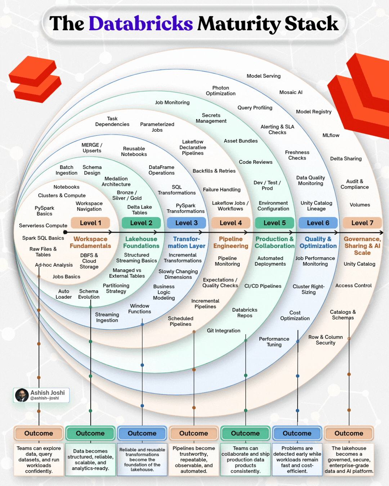
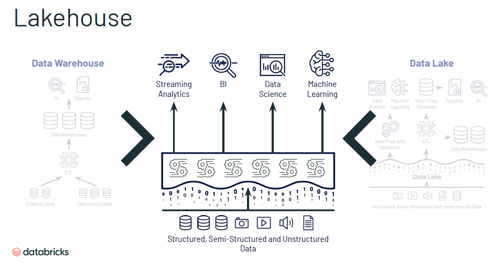

<!-- START doctoc generated TOC please keep comment here to allow auto update -->
<!-- DON'T EDIT THIS SECTION, INSTEAD RE-RUN doctoc TO UPDATE -->
**Table of Contents**

- [1. Databricks Certified Data Engineer Associate (DB-DEA)](#1-databricks-certified-data-engineer-associate-db-dea)
  - [1.1 Exam Breakdown](#11-exam-breakdown)
- [2. Data](#2-data)
  - [2.1 Data Types](#21-data-types)
  - [2.2 Data Document](#22-data-document)
  - [2.3 Data Movement](#23-data-movement)
    - [2.3.1 Batch](#231-batch)
    - [2.3.2 Streaming](#232-streaming)
  - [2.4 Data Modelling](#24-data-modelling)
    - [2.4.1 Relational vs Non-relational](#241-relational-vs-non-relational)
    - [2.4.2  Relational Databases - Schema](#242--relational-databases---schema)
      - [2.4.2.1 DSL (Domain Specific Language)](#2421-dsl-domain-specific-language)
      - [2.4.2.2 Relationships](#2422-relationships)
      - [2.4.2.3 Row-Store](#2423-row-store)
      - [2.4.2.4 Column-Store](#2424-column-store)
    - [2.4.3 Non-Relationnal Databases (Schemaless)](#243-non-relationnal-databases-schemaless)
    - [2.4.4 Pivot Table](#244-pivot-table)
    - [2.4.5 Data Cube](#245-data-cube)
  - [2.5 Data Integrity and Corruption](#25-data-integrity-and-corruption)
    - [2.5.1 Normalized vs Denormalized](#251-normalized-vs-denormalized)
    - [2.5.2 Eventual Consistency vs Strong Consistency](#252-eventual-consistency-vs-strong-consistency)
    - [2.5.3 Synchronous vs Asynchronous](#253-synchronous-vs-asynchronous)
  - [2.6 Data Sources](#26-data-sources)
    - [2.6.1 Datastore](#261-datastore)
    - [2.6.2 Databases](#262-databases)
    - [2.6.3 Data Warehouse](#263-data-warehouse)
      - [2.6.3.1 Data Mart](#2631-data-mart)
    - [2.6.4 Data Lake](#264-data-lake)
    - [2.6.5 Data Lakehouse (not in the exam)](#265-data-lakehouse-not-in-the-exam)
    - [2.6.6 Data Structures](#266-data-structures)
- [3. Databricks](#3-databricks)

<!-- END doctoc generated TOC please keep comment here to allow auto update -->

# 1. Databricks Certified Data Engineer Associate (DB-DEA)

- Managing data within databricks
- Creating ETL Workflows and Jobs within Databricks
- Governance, Security and Quality of Data within Databricks
- Apache Spark SQL Knowledge

Exam code for Databricks Data Engineer DB-DEA: *PR000054

- Practical knowledge over conceptual

Source: https://www.databricks.com/learn/training/certification#certifications

<p align="center"></p>

## 1.1 Exam Breakdown

- 10% Databricks Intelligence Platform
- 30% Development and Ingestion
- 21% Data Processing and Transformation
- 18% Productionizing Data Pipelines
- 11% Data Governance and Quality

More Info:
- 45 Questions - Multiple choice - no 
- 70% Min Score 700/1000 (12-ish questions wrong)
- 1.5 Hours (2 min per question)

# 2. Data

Data: units of information.

```
+------------------------------------------------------------+
| Data - units of information                                |
| +-------------------------------------------------------+  |
| | Data documents - types of abstract grouping of data   |  |
| | +---------------------------------------------------+ |  |
| | | Datasets - Logical grouping of data (*)           | |  |
| | | +-----------------------------------------------+ | |  |
| | | | Data Structures - structured data             | | |  |
| | | | +-------------------------------------------+ | | |  |
| | | | | Data Types - How single units of data are | | | |  |
| | | | | intended to be used / interpreted         | | | |  |
| | | | |                                           | | | |  |
| | | | +-------------------------------------------+ | | |  |
| | | +-----------------------------------------------+ | |  |
| | +---------------------------------------------------+ |  |
| +-------------------------------------------------------+  |
+------------------------------------------------------------+

(* structured or unstructured)
```

## 2.1 Data Types

A data type is (typed) units of information that can be text, numbers, images, videos, audio, physical documents
```
| Data type            |                Typical memory | Typical range / precision              | Key characteristics                                                                                                                       |
| -------------------- | ----------------------------: | -------------------------------------- | ----------------------------------------------------------------------------------------------------------------------------------------- |
| `byte` / `uint8`     |                        1 byte | 0 to 255                               | Smallest commonly addressable integer. Useful for binary data, files, images, and network packets.                                        |
| `sbyte` / `int8`     |                        1 byte | −128 to 127                            | Signed 8-bit integer.                                                                                                                     |
| `short` / `int16`    |                       2 bytes | −32,768 to 32,767                      | Saves memory when values are known to be small. Arithmetic may still be performed using 32-bit registers.                                 |
| `ushort` / `uint16`  |                       2 bytes | 0 to 65,535                            | Unsigned 16-bit integer.                                                                                                                  |
| `int` / `int32`      |                       4 bytes | −2.147 billion to 2.147 billion        | Usually the default integer type. Exact arithmetic within its range. Subject to overflow.                                                 |
| `uint` / `uint32`    |                       4 bytes | 0 to 4.294 billion                     | Doubles the positive range but cannot represent negative values.                                                                          |
| `long` / `int64`     |                       8 bytes | About ±9.22 quintillion                | Useful for timestamps, database identifiers, counters, and large quantities.                                                              |
| `ulong` / `uint64`   |                       8 bytes | 0 to about 18.44 quintillion           | Very large positive integer range. Interoperability can be less convenient because some systems lack unsigned integers.                   |
| `BigInteger`         |                      Variable | Limited mainly by memory               | Arbitrarily large exact integers. Slower and consumes more memory than fixed-size integers.                                               |
| `float` / `float32`  |                       4 bytes | About 7 decimal significant digits     | Fast and compact, but cannot exactly represent most decimal fractions. Accumulated arithmetic error is common.                            |
| `double` / `float64` |                       8 bytes | About 15–17 significant digits         | Default floating-point choice in many languages. More accurate than `float`, but still approximate.                                       |
| `decimal`            |        Usually 16 bytes in C# | About 28–29 significant decimal digits | Base-10-oriented representation. Appropriate for financial calculations. Still cannot represent repeating values such as `1 / 3` exactly. |
| Fixed-point number   |     Depends on representation | Predetermined scale                    | Often implemented as an integer plus an implied decimal scale. Exact for values within the selected scale.                                |
| Complex number       | Usually two floats or doubles | Depends on component type              | Represents a real and imaginary component, such as `3 + 4i`.                                                                              |
| Enum                 | Inherit for int/uint/byte     | Inherit for int/uint/byte              | Group of constants unchangeble states/options                                                                                                |
| 
```

## 2.2 Data Document

Data document is a definition of the collective form in which the data exists.
- Database: structured data that can be quickly accessed and serve searches/queries eg. Azure SQL
- Dataset: a logical grouping of data (structured, semi-structured or unstructured). eg MNIST Dataset
- Datastore: unstructured or semi-structured data repository eg. S3 Bucket / Azure Datalake
- Data Warehouse: structured or semistructured data that serve analytics and reports eg Azure Synapse Analytics
- Notebooks: data that is arranged in pages or cells designed for easy consumption eg Jupyter Notebooks

## 2.3 Data Movement


### 2.3.1 Batch

When you send batches (or collections) of data to be processed. Usually:
- Scheduled
- Not realtime
- Cost effective
- Good for large workloads

### 2.3.2 Streaming

You process the data as soon as it arrives using a pipeline of producers and consumers
- Good for real-time analytics
- Most expensive
- eg [Kafka](../../messaging/kafka/README.md)

## 2.4 Data Modelling

How do we design our data? 

### 2.4.1 Relational vs Non-relational

How do we access our data for query and search?

### 2.4.2  Relational Databases - Schema

How do we structure out data for search?

- Schema: formal language that defines the structure of the data
  - Tables - logical grouping of data (rows and columns (fields)).
  - Fields - or columns, usually a types unit of data that belongs to a table,
  - Relationships - used as contraints to guarantee data integrity between same, two or more tables (Primary key/Foreign Key),
  - Indexes - structure created to map and sort rows in a table allowing binary (faster searches),
  - Views - usually a result of a query that is stored only in memory and that can be used as a normal table,
  - Materialized views - same as views, but the data is stored in disk,
  - Procedures - a sequence of commands that executes a specific operation logic
  - Triggers - a mechanism that executes a procedure or a function based on events
  - Packages - a container that cen be used to logically group functions, procedures, variables, constants, cursors, exceptions
  - Functions - a command that executes a specific operation
  - XML/JSON Schemas - a data validation structure that ensures expected values
  - Queues, TBD
  - Types, Link to [Data Types](README.md#21-Data-Types)
  - Sequences, TBD
  - Database links, TBD
  - Directories, TBD

#### 2.4.2.1 DSL (Domain Specific Language)

Schemas, DSLs (Domain Specific Languages), and tools like Pydantic are essential because they
automate data validation, type-checking, and serialization. They act as a strict contract between
different parts of a system, preventing errors, ensuring data integrity,
and making codebases easier to maintain and document.

#### 2.4.2.2 Relationships


Most common:
- one to one, eg. Country has a Capital
- one to many, eg. Country has a City
- many to many, eg. Country has *many* Visitors, a Visitor can visit *many* Countries
- many to many, via Junction Table eg. CountryVisior has foreignKey of country.ID and visitor.ID

#### 2.4.2.3 Row-Store

- Data is organized in Rows
- Traditional RDBMS are row-stores
- Good for general purpose databases, write intensive data pipelines
- Suited for OLTP Online Transactional Processing
- Great when all columns data in row is required in on reads
- Not the best for analytics or querying a massive amounts of data

eg. PostgreSQL, SQL Server, Cassandra, ScylladDB

#### 2.4.2.4 Column-Store

- Data is organized into columns
- Good for reads and aggregating values for analytics
- NoSQL Stores or SQL Like Databases
- Suited for OLAP Online Analytical Processing
- Great for processing large database scans querying

eg. BigTable, RedShift

  
### 2.4.3 Non-Relationnal Databases (Schemaless)

"Schemaless" data management refers to handling dynamic data structures that lack a fixed,
predefined schema at storage time. This is typically achieved using native dictionary types,
interacting with NoSQL document databases, or building relational-backed key-value abstractions.

- Schemaless: when the data or data instance or primary "cell" of the data can accept many types
  -  Key/Value, Document, Columns/WideColumns, Graph

### 2.4.4 Pivot Table

It's a data table that reorganizes data from the original table, with more extensive data,
summarizing its information producing a different view where it's easy to find figures and facts.

### 2.4.5 Data Cube

A pivot table and a data cube both summarize data across multiple dimensions, but they operate at different levels.
A pivot table is mainly an interactive presentation and analysis tool.
A data cube is mainly a multidimensional analytical data structure or model.
The pivot table is one two-dimensional view of that multidimensional cube.

| Pivot table                                 | Data cube                                           |
| ------------------------------------------- | --------------------------------------------------- |
| A report or interactive view                | A multidimensional analytical model                 |
| Usually displays two dimensions at once     | Can model many dimensions simultaneously            |
| Often created by an end user                | Usually designed by data engineers or BI developers |
| Common in Excel and spreadsheets            | Common in OLAP, warehouses and BI platforms         |
| Often calculated from source data on demand | May contain precomputed aggregations                |
| Best for exploration and presentation       | Best for reusable, large-scale analytics            |
| Usually tied to one worksheet or report     | Can support many reports and users                  |

## 2.5 Data Integrity and Corruption

- Data Integrity is the maintanance of data assurance, accuracy in its entire life-cycle.
  - Proxy term for data quality, data validation is a pre-requisite for data integrity

- Data corruption is the opposite of data Integrity
  - Is the act or state of the data NOT being in the intended state AND WILL RESULT IN DATA LOSS or MISINFORMATION
  - Data corruption occurs when unintended changes result in READING, WRITING and/or TRANSFERRING **WITH**:
    - UNEXPECTED HARDWARE FAILURES
    - HUMAN ERROR when INPUTING / MODIFYING DATA
    - MALICIOUS ACTORS with the intention to CORRUPT your data
    - Unforenseen side effects for automated operations via sottware
  -  Data Integrity and how to ensure it? <---IMPORTANT
    - with a well defined documented data modeling <---IMPORTANT
    - logical contraints on your database models <---IMPORTANT
    - Redundent and access to versions of the data with the ability to restore <---IMPORTANT
    - Human analysis of the data (QA) <---IMPORTANT
    - Hash functions to determine if changes were made (tempered) <---IMPORTANT
    - Principles of least-previleges (Limiting access to specific actions and resources for specific user roles) <---IMPORTANT

### 2.5.1 Normalized vs Denormalized

Trading quality versus speed

| Normalized                                     | Denormalized                                 |
|------------------------------------------------|----------------------------------------------|
| Schema designed to store Non-redundent and     | Schema that combines data so that accessing  |
| consistent data.                               | data (querying) is fast                      |
| * DATA INTEGRITY IS MAINTAINED                 | * DATA INTEGRITY IS NOT MAINTAINED           |
| * LITTLE TO NO REDUNDANT DATA                  | * REDUNDANT DATA IS COMMON                   |
| * MANY TABLES                                  | * FEWER TABLES, EXCESSIVE DATA               |
| * OPTIMIZES FOR EFFICIENT STORAGE OF DATA      | * ULTRA FAST READ QUERYING                   |


(*) With NoSQL databases, data is usually denormalized.

### 2.5.2 Eventual Consistency vs Strong Consistency

Data consistency is the process of managing the state of the data in case it's kept in 2 or more places.
The data is considered consistent if copies match.

When you have to have duplicates of your data in many places and need to keep them up to date to be
exact matching

| Strong Consistency       | Eventual Consistency   |
|--------------------------|------------------------|
| Every time you request the data (query) you can expect consistent data to be returned with X time (1 second) | When you request data you may get back inconsistent data within 2 seconds |
| We'll never return to you old data. But you have to wait at least 2 seconds for the query to return | The data is always returned, but it might be old or new, but over time it might get updated if user wait a little bit longer |


### 2.5.3 Synchronous vs Asynchronous

| Synchronous | Asynchronous |
|-------------|--------------|
| Continuous **stream** of data that is synchronized by a time or a clock (guarantee of time). |  Continuous **stream** of data that is separated by start and stop bits (no guarantee of time) |

Synchronous case. A company has a primary database, but they need to have a backup database in case the primary fails.
The company cannot lose any data, so it must be in-sync.
The database is not going to be accessed while it's standing by to act as a replacement.

Asynchronous case. A company has a primary database but they want a **read-replica** (copy of the database) so their data analytics person can create computational intensive reports that
_do not_ impact the response time of the primary instance. It does not matter if the data is exactly 1-to-1 at the time of the access.

TODO: elaborate on atomicity on sync ops, CQRS, etc

## 2.6 Data Sources

- Data Vendors
  - API Pooling 
  - SFTP Pooling
  - Websocket/GraphQL Subscription
  - rsync
- Data Lake
- Data Store
- Database

Consumed by a CONNECTOR:

```
                                  + - Messaging Producer Code (streaming)
                                /
                               _ Direct Extract Code (ETL / ELF)
                             /
 Data source -> CONNECTOR ----- Integration Tool (ETL Engines, SSIS, Data Lake, Warehouse)
                             \
                               + - Data Extractions Tools (TODO: research on comercial)
                                \
                                  + - Custom data scrapping and automation tools (Python/SQL scripting / UPA tools)

```

### 2.6.1 Datastore

A Datastore a repository for persistently storing and managing collections of **unstructured** or **semi-structured data**. (Not necessarily a database).

- Flatfiles
- Documents, Emails, Messages
- CSV, TSV, Parquet, .delta, iceberg, orc, json, bjson, ndjson, avro, https://mbvyn.medium.com/understanding-databricks-data-formats-explained-parquet-orc-avro-and-delta-b8b561f6b4ec

```
  +---+
  |   |-------+
  +---+         \
                  \_____
     +---+               \    ___
     |   |----------------> /     \
     +---+             /   |\_____/|
                      /    |  DS   |
       +---+        /       \_____/
       |   |------+
       +---+
```

### 2.6.2 Databases

Generally categorized as:

- Relational databases (RDBMS)
  - Structured data that strongly represents tabular data (tables, rows, columns)
  - Row-oriented or columnar-oriented
- Non-relational databases (NoSQL)
 - Semi structured databases that may or may not distantly resemble tabular data

Databases have rich set of functionality
- specialized query language to manipulate
- specialized data modeling strategies to optimize retriaval for different use cases
- more fine tune control over the transformation of the data into useful data structures or reports

### 2.6.3 Data Warehouse

A relational / non-relational datastore designed for analytics workloads, which is generally column-oriented datastore.

Companies have terabytes/pentabytes and million of rows of data and they need a fast way to produce analytics reports.

Data warehouses generally perform **aggregation**
- Grouping of data to compute metrics like total sum or average.
- Data warehouses are optimized around columns since they need to quickly aggregate column data
- Data warehouses are designed for _fast reading_ over a vast amount of data due to reporting requirements
- Data warehouses are designed for infrequently accessing meaning meaning they aren't intended for
real-time reporting but for once or twice a day or once a week for business reports.
- DW need to consume data from operational relational databases on a regular bases to extract intelligence information

#### 2.6.3.1 Data Mart

- subset of data warehouse (pulled as snapshot)
- under 100GB
- single business focus
- designed to be read-only
- **increases the frequency to which the data can be accessed**
- cost to query is ultra low

  


### 2.6.4 Data Lake

- centralized data repository for various data resources including raw data sets, big data, semi-structured, unstructured formats
- data lake lets you store all your data without careful design or preparation, without having to answer questions on the future use of the data
- holding for data scientist

A data lake is commonly accessed for data workloads such as:
- data visualizations (~~business intelligence~~ *)
- real-time analytics
- machine learning
- On-premmise Data

* data lake are great for dat scientinst but it's very hard to use for BI reporting as it normally needs intensive work on preparation/transformation

If data lakes are not well maintained they can become data swamps (a mess of data)

### 2.6.5 Data Lakehouse (not in the exam)

It combines the best elements of Data Lake and Data warehouse

Data Lakehouse compared to Data Warehouse
- support video, audio, and text files
- support data science and ML workloads
- have support for streaming and ETL
- work with many open source formats
- Data will generally reside in data lakes or blob stores

Data lakehouse comapre to Data Lakes:
- perform BI tasks very well
- much easier to setup and maitain
- has many features to enforce and prevent the data lake to become data swamps
- more performant than a data lake

Apache Delta Lake

<p align="centered"> </p>


### 2.6.6 Data Structures

- Data that is organized in an specific format that enable easy access and modification.
- Data structure can store various data types.

Degree of structure:
- Unstructured - data that is stored without a structure and without a possible relation (like your Download folder)
- Semi-structured - data that can be browsed and searched (with limitations) (like your csv dataset)
- Structured - data that can be fully browsed and searched (like your sqlite file)

# 3. Databricks

Full blown data operations SaaS and managed Apache Spark Clusters

Key (open source) technologies:
- Apache Spark
- Delta Lake
- MLFlow


The main offerings:
- Databricks Platform
  - Databricks cloud-based spark platform with an easy-to-use webUI
  - Launch fully managed Spark Clusters
  - Launch Notebooks to write code and interact with Spark
  - Create workspaces to collaborate with team members
  - Role Base Access Control (RBAC)
  - Create jobs for ETL or data analytics tasks that run immediately or on a schedule
  - Create MLflow workflows
  - **Available on all main cloud providers AWS, Azure, GCP**
- Databricks Community Edition - free version of Databricks plarform for Educational use
  - Create a free micro-cluster that terminates after 2 hours when idle
  - No workspace, jobs, RBAC
    
  


